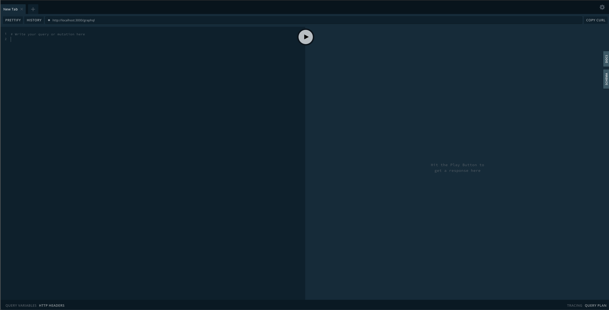

<p align="center">
  <a href="http://nestjs.com/" target="blank"></a>
</p>
## Description

GraphQL vote example server with [Nest](https://github.com/nestjs/nest) framework.

## Installation

```bash
$ npm install
```


## Running the app

```bash
# development
$ npm run start

# watch mode
$ npm run start:dev

# production mode
$ npm run start:prod
```


## Test

```bash
# unit tests
$ npm run test

# e2e tests
$ npm run test:e2e

# test coverage
$ npm run test:cov
```


## GraphQL Playground



Go to [http://your-server-ip:3000/graphql](http://your-server-ip:3000/graphql).

